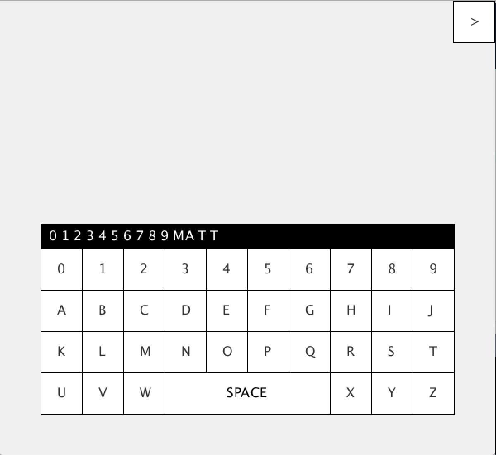

# Tiny Computer
## Matthew Damiata - Spring 2019
### Processing - Java Environment

## KNOWN BUGS AND INCOMPLETE PARTS:
- This is a small project I created using the Processing environment for Java.

- [Processing](https://processing.org)

###Initial Screen

###Final Screen

